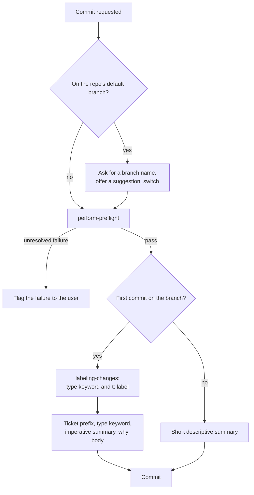
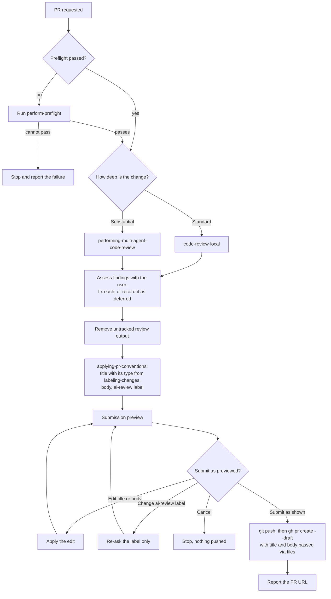
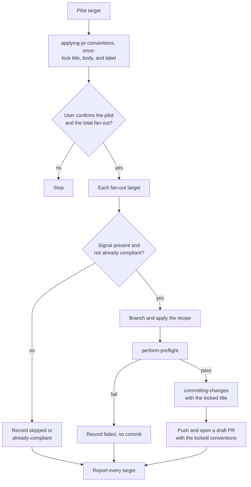

# Commit and Pull Request Flows

The commit and pull request skills compose one another, so a change to one skill's contract can ripple into every skill that calls it. These diagrams show those seams: which skill owns each decision, and where control passes between skills.

The `SKILL.md` files are authoritative. Where a diagram and a skill disagree, the skill wins and the diagram needs updating.

## Committing a change

The branch check runs before anything is staged, so work never lands on the default branch by accident. Only the first commit on a branch needs the full message format; followups can be a short summary.

## Opening a pull request

Preflight settles before the review because fixing a preflight failure can change the diff the review needs to see. The submission preview is the single point where every decision is visible together, and nothing is pushed until the user confirms it. Editing the label from the preview re-asks only the label, since re-entering `applying-pr-conventions` would recompose the title and body and discard an edit already made.

## Fanning a change across many targets

`force-multiplier` reuses the same skills across a fleet but cannot answer the conventions questions once per target, so it resolves them once at the pilot and locks the result. Every fan-out target then runs preflight and commits non-interactively against that locked title, body, and label.

