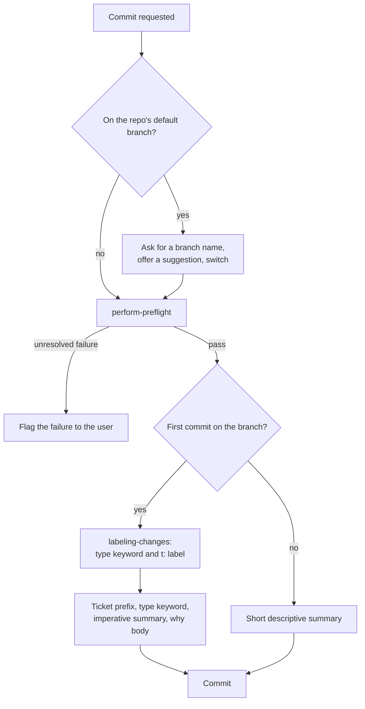
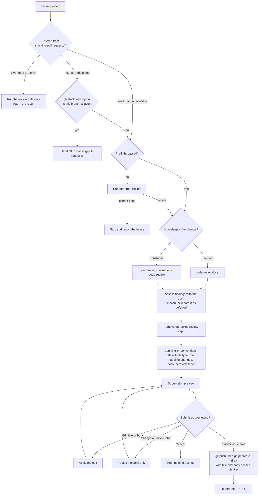
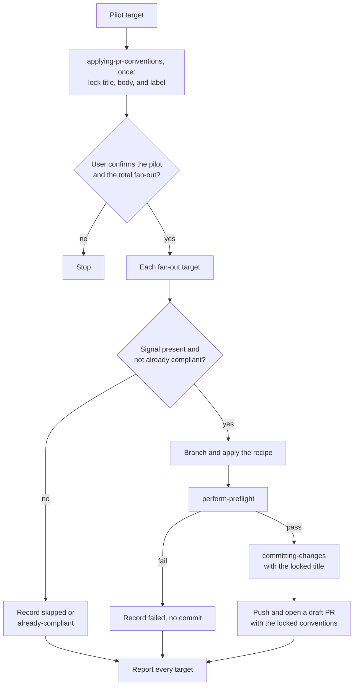
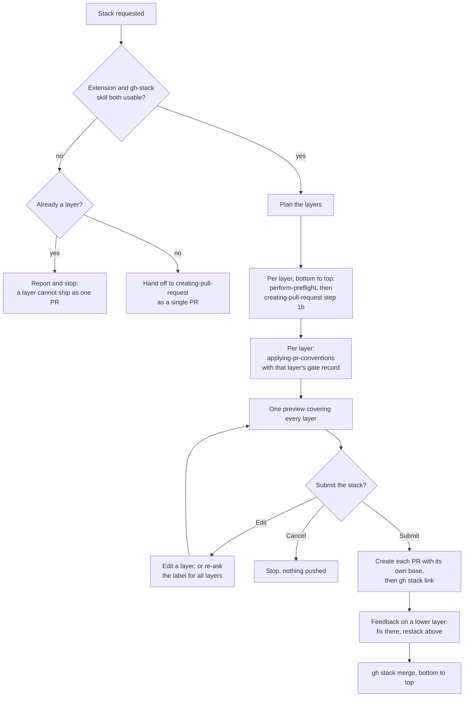

# Commit and Pull Request Flows

The commit and pull request skills compose one another, so a change to one skill's contract can ripple into every skill that calls it. These diagrams show those seams: which skill owns each decision, and where control passes between skills.

The `SKILL.md` files are authoritative. Where a diagram and a skill disagree, the skill wins and the diagram needs updating.

## Committing a change

The branch check runs before anything is staged, so work never lands on the default branch by accident. Only the first commit on a branch needs the full message format; followups can be a short summary.

```mermaid
graph TD
    start[Commit requested]
    onDefault{On the repo's default branch?}
    newBranch[Ask for a branch name,<br/>offer a suggestion, switch]
    preflight[perform-preflight]
    blocked[Flag the failure to the user]
    first{First commit on the branch?}
    typeKeyword[labeling-changes:<br/>type keyword and t: label]
    full[Ticket prefix, type keyword,<br/>imperative summary, why body]
    short[Short descriptive summary]
    done[Commit]

    start --> onDefault
    onDefault -->|yes| newBranch
    onDefault -->|no| preflight
    newBranch --> preflight
    preflight -->|pass| first
    preflight -->|unresolved failure| blocked
    first -->|yes| typeKeyword
    typeKeyword --> full
    first -->|no| short
    full --> done
    short --> done
```

## Opening a pull request

Preflight settles before the review because fixing a preflight failure can change the diff the review needs to see. The submission preview is the single point where every decision is visible together, and nothing is pushed until the user confirms it. Editing the label from the preview re-asks only the label, since re-entering `applying-pr-conventions` would recompose the title and body and discard an edit already made.

Routing comes first. A chain of dependent pull requests belongs to `stacking-pull-requests`, and so does a branch that is already a layer even when the request never says so, because the submission below passes no `--base`. Two entries arrive from that skill already routed and are never handed back: the fallback it takes when the `gh-stack` tooling is unusable, which runs the whole workflow, and a single layer's review gate, which runs step 1b alone and returns.

```mermaid
graph TD
    start[PR requested]
    routed{Entered from<br/>stacking-pull-requests?}
    gateOnly[Run the review gate only,<br/>return the result]
    layerProbe{gh stack view --json:<br/>is this branch a layer?}
    handoff[Hand off to stacking-pull-requests]
    preflightDone{Preflight passed?}
    runPreflight[Run perform-preflight]
    preflightFailed[Stop and report the failure]
    depth{How deep is the change?}
    standard[code-review-local]
    substantial[performing-multi-agent-code-review]
    assess[Assess findings with the user:<br/>fix each, or record it as deferred]
    clean[Remove untracked review output]
    conventions[applying-pr-conventions:<br/>title with its type from labeling-changes,<br/>body, ai-review label]
    preview[Submission preview]
    confirm{Submit as previewed?}
    edit[Apply the edit]
    relabel[Re-ask the label only]
    cancel[Stop, nothing pushed]
    push[git push, then gh pr create --draft<br/>with title and body passed via files]
    url[Report the PR URL]

    start --> routed
    routed -->|"layer gate (1b only)"| gateOnly
    routed -->|"stack path unavailable"| preflightDone
    routed -->|no, user-originated| layerProbe
    layerProbe -->|yes| handoff
    layerProbe -->|no| preflightDone
    preflightDone -->|yes| depth
    preflightDone -->|no| runPreflight
    runPreflight -->|passes| depth
    runPreflight -->|cannot pass| preflightFailed
    depth -->|Standard| standard
    depth -->|Substantial| substantial
    standard --> assess
    substantial --> assess
    assess --> clean
    clean --> conventions
    conventions --> preview
    preview --> confirm
    confirm -->|Submit as shown| push
    confirm -->|Edit title or body| edit
    confirm -->|Change ai-review label| relabel
    confirm -->|Cancel| cancel
    edit --> preview
    relabel --> preview
    push --> url
```

## Fanning a change across many targets

`force-multiplier` reuses the same skills across a fleet but cannot answer the conventions questions once per target, so it resolves them once at the pilot and locks the result. Every fan-out target then runs preflight and commits non-interactively against that locked title, body, and label.

```mermaid
graph TD
    pilot[Pilot target]
    conventions[applying-pr-conventions, once:<br/>lock title, body, and label]
    confirm{User confirms the pilot<br/>and the total fan-out?}
    stop[Stop]
    target[Each fan-out target]
    applicable{Signal present and<br/>not already compliant?}
    skipped[Record skipped or<br/>already-compliant]
    apply[Branch and apply the recipe]
    preflight[perform-preflight]
    failed[Record failed, no commit]
    commit[committing-changes<br/>with the locked title]
    draft[Push and open a draft PR<br/>with the locked conventions]
    report[Report every target]

    pilot --> conventions
    conventions --> confirm
    confirm -->|no| stop
    confirm -->|yes| target
    target --> applicable
    applicable -->|no| skipped
    applicable -->|yes| apply
    apply --> preflight
    preflight -->|fail| failed
    preflight -->|pass| commit
    commit --> draft
    draft --> report
    skipped --> report
    failed --> report
```

## Chaining dependent pull requests

`stacking-pull-requests` is the other multi-pull-request shape. Where `force-multiplier` resolves the conventions once and locks them, a stack answers them per layer: the ticket key and the label carry across the chain, but the type keyword, the body, and the review gate are per layer, because each layer is its own pull request reviewed against its parent. Step 0 gates on tooling that is not installed by default, and every unusable outcome falls back rather than half-attempting a stack.

```mermaid
graph TD
    start[Stack requested]
    tooling{Extension and gh-stack<br/>skill both usable?}
    isLayer{Already a layer?}
    stop[Report and stop:<br/>a layer cannot ship as one PR]
    single[Hand off to creating-pull-request<br/>as a single PR]
    plan[Plan the layers]
    gate[Per layer, bottom to top:<br/>perform-preflight, then<br/>creating-pull-request step 1b]
    conventions[Per layer:<br/>applying-pr-conventions<br/>with that layer's gate record]
    preview[One preview covering every layer]
    confirm{Submit the stack?}
    edit[Edit a layer, or re-ask<br/>the label for all layers]
    cancel[Stop, nothing pushed]
    submit[Create each PR with its own base,<br/>then gh stack link]
    feedback[Feedback on a lower layer:<br/>fix there, restack above]
    merge[gh stack merge, bottom to top]

    start --> tooling
    tooling -->|no| isLayer
    isLayer -->|yes| stop
    isLayer -->|no| single
    tooling -->|yes| plan
    plan --> gate
    gate --> conventions
    conventions --> preview
    preview --> confirm
    confirm -->|Submit| submit
    confirm -->|Edit| edit
    confirm -->|Cancel| cancel
    edit --> preview
    submit --> feedback
    feedback --> merge
```
