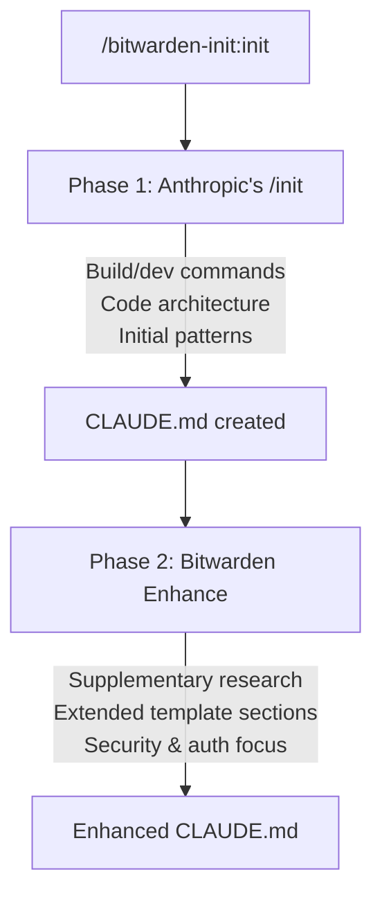

# Bitwarden Init Plugin

Initialize Claude Code configuration with Bitwarden's standardized template format.

## Overview

This plugin provides a `/bitwarden-init:init` command that generates a comprehensive CLAUDE.md file by combining Anthropic's built-in `/init` analysis with Bitwarden's extended template structure. The two-phase approach ensures thorough codebase analysis followed by Bitwarden-specific enhancements.

## Installation

### From Bitwarden Marketplace

```bash
/plugin install bitwarden-init@bitwarden-marketplace
```

After installation, restart Claude Code to activate the plugin.

## Usage

Navigate to your repository in Claude Code and run:

```
/bitwarden-init:init
```

This triggers a two-phase initialization process:

1. **Phase 1 - Anthropic's /init**: Analyzes your codebase to generate an initial CLAUDE.md with build commands, architecture overview, and detected patterns

2. **Phase 2 - Bitwarden Enhancement**: Reads the generated CLAUDE.md, performs supplementary research, and extends it with Bitwarden's standardized sections

### What Happens



### Enhance Only

If you already have a CLAUDE.md file and want to extend it with Bitwarden's template sections:

```
/bitwarden-init:enhance
```

This reads your existing file, performs supplementary research, and restructures the content to match Bitwarden's standardized format.

## Template Structure

The generated CLAUDE.md file includes these sections:

| Section | Contents |
|---------|----------|
| **Overview** | Business domain, key concepts, user types, integration points |
| **Architecture & Patterns** | Structure, module boundaries, design patterns, external services |
| **Stack Best Practices** | Language idioms, framework patterns, error handling, testing |
| **Anti-Patterns** | Common mistakes, security concerns, performance pitfalls |
| **Data Models** | Domain entities, DTOs, validation rules, database patterns |
| **Configuration, Security, and Authentication** | Environment management, secrets, auth flows, compliance |

## Requirements

- `claude` CLI must be installed and available in PATH
- Sufficient permissions to run Claude Code non-interactively

## Benefits

- **Comprehensive**: Combines Anthropic's analysis with Bitwarden's structure
- **Standardization**: Consistent documentation format across all Bitwarden repositories
- **Onboarding**: New team members can quickly understand codebase patterns
- **AI Context**: Provides Claude with comprehensive project context for better assistance
- **Security Focus**: Emphasizes authentication, authorization, and data protection patterns

## Customization

After initialization, you can:
- Refine the generated content to add project-specific details
- Update sections as the codebase evolves
- Re-run `/bitwarden-init:enhance` to refresh content after major changes

## Plugin Structure

```
bitwarden-init/
├── .claude-plugin/
│   └── plugin.json
├── commands/
│   ├── init/
│   │   ├── init.md              # Main command (runs the chain)
│   │   └── scripts/
│   │       └── run-init-chain.sh
│   └── enhance/
│       └── enhance.md           # Enhancement-only command
├── CHANGELOG.md
├── CONTRIBUTING.md
└── README.md
```

## Contributing

See [CONTRIBUTING.md](../../CONTRIBUTING.md) for guidelines on contributing to this plugin.

## Changelog

See [CHANGELOG.md](CHANGELOG.md) for version history and updates.

## License

See [LICENSE.txt](../../LICENSE.txt) for licensing information.
