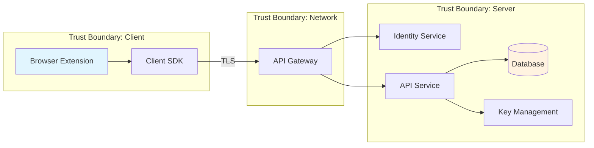

## Bitwarden's Engagement Model

Bitwarden follows a 4-phase engagement model for security work. This skill primarily supports Phase 1 (engineering-owned) and assists with Phase 2-4 artifacts.

### Phase 1: Initial Security Assessment (Engineering Team)

1. Create data flow diagrams (Mermaid, Excalidraw, or Structurizr)
2. Define security requirements separate from product requirements
3. Propose security definitions (threat model + security goals)
4. Identify initial threats using STRIDE

### Phase 2: AppSec Team Review (AppSec + Engineering)

- Share data flow diagrams and security definitions in advance
- Walk through system architecture collaboratively
- Validate or refine proposed security definitions
- Identify additional threats, assess risk
- Avoid assuming external mitigations exist

### Phase 3: Implementation (Engineering Team)

- Implement necessary security mitigations
- Create Jira follow-up work for threats without existing protections
- Include security considerations in sprint planning

### Phase 4: Testing & Validation (Engineering + AppSec)

- Verify mitigations work as intended
- Adopt adversarial mindset during code review
- Test hypotheses (e.g., "Can I bypass SSO?") by working backwards
- Update security definitions as the system evolves

## Security Definitions

Security definitions are Bitwarden's formal construct for communicating the security goals of a system. Each definition has two components:

### Threat Model Component

Describes the capabilities of potential attackers. Examples:

- "The attacker can intercept network traffic between the client and server"
- "The attacker has read access to the database but not write access"
- "The attacker controls a browser extension running alongside our extension"
- "The attacker can send arbitrary API requests with a valid auth token"

**Key principle:** Don't assume external mitigations are in place. Even if it's difficult for an attacker to obtain an auth token, still explore what happens if they do.

### Security Goals Component

Outlines what the system promises to protect against, given the assumed threat model. Examples:

- "Given the threat model above, vault data remains confidential even if the server is fully compromised"
- "Given the threat model above, an attacker with a valid session token cannot access another user's vault"
- "Given the threat model above, organizational policies cannot be bypassed by modifying client-side state"

### Writing Security Definitions

- It's OK to be wrong — the purpose is to start the conversation and see if these can be broken
- Start with what the system SHOULD guarantee, then validate through threat analysis
- Reference existing definitions at [Definitions | Bitwarden Contributing Documentation](https://contributing.bitwarden.com/architecture/deep-dives/security-definitions/)
- Separate macro-level definitions (e.g., end-to-end encryption) from micro-level definitions specific to the feature

## STRIDE Framework

Use STRIDE as a guide for structured threat identification. Some vulnerabilities won't map cleanly to STRIDE — that's expected.

| Category                   | Question to Ask                                    | Example Threats                                               | Typical Mitigations                                      |
| -------------------------- | -------------------------------------------------- | ------------------------------------------------------------- | -------------------------------------------------------- |
| **Spoofing**               | Can an attacker impersonate a user or component?   | Forged auth tokens, session hijacking, credential stuffing    | Strong authentication, token validation, MFA             |
| **Tampering**              | Can an attacker modify data in transit or at rest? | Man-in-the-middle, database manipulation, parameter tampering | Integrity checks, signed payloads, TLS, input validation |
| **Repudiation**            | Can an attacker deny performing an action?         | Missing audit logs, unsigned transactions                     | Audit logging, digital signatures, timestamps            |
| **Information Disclosure** | Can an attacker access data they shouldn't?        | Verbose errors, insecure storage, side-channel leaks          | Encryption, access controls, error sanitization          |
| **Denial of Service**      | Can an attacker degrade or prevent service?        | Resource exhaustion, algorithmic complexity attacks           | Rate limiting, input size bounds, circuit breakers       |
| **Elevation of Privilege** | Can an attacker gain unauthorized access?          | Broken access control, privilege escalation, IDOR             | Authorization checks at every layer, least privilege     |

## Artifact Generation

### Data Flow Diagram (Mermaid)

Use Mermaid syntax for text-based DFDs that can be version-controlled:



Include: components, data stores, external entities, data flows with protocols, and trust boundaries.

Note: Bitwarden is moving toward a Structurizr-based approach for persistent architecture diagrams. For ad-hoc threat modeling, Mermaid or Excalidraw are acceptable.

### Security Definition Document

```markdown
## Security Definition: [Feature/System Name]

### Threat Model

- Attacker capability 1: [description]
- Attacker capability 2: [description]
- Attacker capability 3: [description]

### Security Goals

Given the threat model above:

1. [What the system guarantees]
2. [What the system guarantees]
3. [What the system guarantees]

### Assumptions

- [External dependency or assumption]
```

### Threat Catalog

| #   | Threat      | STRIDE      | Component          | Existing Mitigation | Proposed Mitigation  | Risk Level               |
| --- | ----------- | ----------- | ------------------ | ------------------- | -------------------- | ------------------------ |
| 1   | Description | S/T/R/I/D/E | Affected component | What exists today   | What should be added | Critical/High/Medium/Low |

### Mitigation Tracking

For threats without existing mitigations, document for Jira follow-up:

```markdown
## Unmitigated Threat: [Title]

- **Threat:** [Description]
- **STRIDE Category:** [Category]
- **Affected Component:** [Component]
- **Impact:** [What happens if exploited]
- **Proposed Mitigation:** [What to implement]
- **Priority:** [Based on risk assessment]
```

## When to Engage AppSec

Teams should initiate a full engagement with the AppSec team (#team-eng-appsec) when:

- **Greenfield projects** or new services
- **Data sharing modifications** (organization memberships, Send, sharing features)
- **New IPC channels** between components
- **Cross-domain or cross-origin** functionality
- **Uncertain about security implications** — perform an Initial Security Assessment first and post findings to #team-eng-appsec with a note that you're unsure if a full engagement is needed

Quick questions (e.g., concerns about a third-party library or coding practice) don't need a full engagement — post those directly to #team-eng-appsec.

## Critical Rules

- **Separate product requirements from security requirements** in tech breakdowns. They serve different purposes and have different stakeholders.
- **Security definitions are living documents.** Revisit them when features change, new threats emerge, or security issues are discovered.
- **Complexity increases vulnerability risk.** Flag overly complex security-critical code as tech debt. Complex code with numerous dependencies and intricate logic is exceptionally challenging to secure.
- **Threat modeling will never identify all vulnerabilities.** It's one tool among many. Balance it with code analysis, security testing, and adversarial review.
- **Don't assume external mitigations.** When defining the threat model, explore what happens if an attacker bypasses external controls.

## Further Reading

- [Definitions | Bitwarden Contributing Documentation](https://contributing.bitwarden.com/architecture/deep-dives/security-definitions/)
- [Threat Modeling Manifesto](https://www.threatmodelingmanifesto.org/)
- [Threat Modeling Guide for Software Teams](https://martinfowler.com/articles/agile-threat-modelling.html)
- [OWASP Threat Modeling Process](https://owasp.org/www-community/Threat_Modeling_Process)
