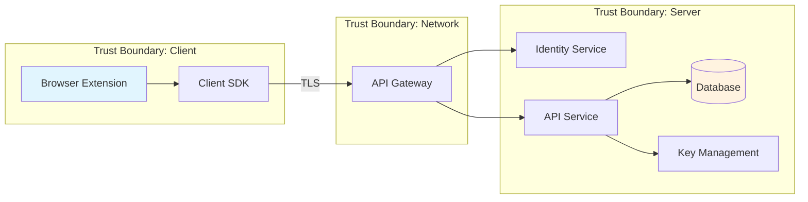

## Bitwarden's Engagement Model

Bitwarden follows a 4-phase engagement model for security work. This skill primarily supports Phase 1 (engineering-owned) and assists with Phase 2-4 artifacts.

### Phase 1: Initial Security Assessment (Engineering Team)

1. Create data flow diagrams (Mermaid, Excalidraw, or Structurizr)
2. Define security requirements separate from product requirements
3. Propose security definitions (threat model + security goals)
4. Identify initial threats using STRIDE

### Phase 2: AppSec Team Review (AppSec + Engineering)

- Share data flow diagrams and security definitions in advance
- Walk through system architecture collaboratively
- Validate or refine proposed security definitions
- Identify additional threats, assess risk
- Avoid assuming external mitigations exist

### Phase 3: Implementation (Engineering Team)

- Implement necessary security mitigations
- Create Jira follow-up work for threats without existing protections
- Include security considerations in sprint planning

### Phase 4: Testing & Validation (Engineering + AppSec)

- Verify mitigations work as intended
- Adopt adversarial mindset during code review
- Test hypotheses (e.g., "Can I bypass SSO?") by working backwards
- Update security definitions as the system evolves

## Security Definitions

Security definitions are Bitwarden's formal construct for communicating the security posture of a system. Each definition has two components: a **threat model** (attacker capabilities) and **security goals** (what the system guarantees).

### Core Vocabulary

Use Bitwarden's standard terminology when writing security definitions:

- **Vault Data** — A user's private information stored in Bitwarden (passwords, usernames, secure notes, credit cards, identities, attachments)
- **Protected Data** — Data stored in unreadable format (typically encrypted) with expectations about secure key storage
- **Data at Rest / in Use / in Transit** — The three data states. "At rest" is stored data on disk. "In use" is data in volatile memory during processing. "In transit" is data moving between locations, processes, or devices.
- **Secure Channel** — A communication channel providing confidentiality (unreadable to unauthorized parties) and integrity (tamper-proof)
- **Trusted Channel** — A secure channel that also provides authenticity (verified identities of communicating parties)
- **Data Exporting** — Controlled process where data leaves Bitwarden unprotected, nullifying security guarantees. Requires informed and explicit consent.
- **Data Sharing** — Controlled data exchange within the Bitwarden secure environment (security guarantees maintained)
- **Data Leaking** — Unintentional departure of data from Bitwarden unprotected
- **Bitwarden Secure Environment** — Any process or application adhering to Bitwarden's security standards

### Threat Model Component

Describe the capabilities of potential attackers — what they can do, not how they do it:

- "The attacker has read access to the database but cannot modify stored data"
- "The attacker controls a browser extension running alongside our extension"
- "The attacker can intercept network traffic between client and server"
- "The attacker has full userspace access on a device with a locked vault"
- "The attacker can send arbitrary API requests with a valid auth token"

**Key principle:** Don't assume external mitigations are in place. Even if obtaining an auth token is difficult, still explore what happens if an attacker has one.

### Security Goals Component

Define what the system promises to protect against, given the threat model. Align goals with Bitwarden's security principles (P01-P06) where applicable:

- "Given the threat model above, the server cannot retrieve decrypted vault data or user encryption keys" (P01: Zero Knowledge)
- "Given the threat model above, vault data cannot be accessed in plaintext once the vault is locked" (P02: Locked Vault is Secure)
- "Given the threat model above, clients maximize OS/kernel-level protections for vault data in memory" (P03: Semi-Compromised)
- "Given the threat model above, vault data is accessible only to authorized parties under the user's explicit control" (P05: Controlled Access)
- "Given the threat model above, data added after key rotation remains protected even if pre-rotation data was compromised" (P06: Minimized Breach Impact)

### Writing Security Definitions

- It's OK to be wrong — the purpose is to start the conversation and see if these can be broken
- Start with what the system SHOULD guarantee, then validate through threat analysis
- Reference the official vocabulary and existing definitions at [Security Definitions](https://contributing.bitwarden.com/architecture/security/definitions)
- Separate macro-level definitions (e.g., end-to-end encryption) from micro-level definitions specific to the feature

## Bitwarden Security Principles

These six principles form the foundation for all threat modeling at Bitwarden. Reference them when writing security goals and evaluating threats.

| Principle | Name                                         | Core Guarantee                                                                                                                                                                                                                                       |
| --------- | -------------------------------------------- | ---------------------------------------------------------------------------------------------------------------------------------------------------------------------------------------------------------------------------------------------------- |
| **P01**   | Servers are Zero Knowledge                   | Bitwarden infrastructure cannot access unencrypted user data. The server must not enable weakening of user-chosen protections, masquerade server data as user-encrypted content, or access encrypted data outside the client context.                |
| **P02**   | A Locked Vault is Secure                     | Highly sensitive vault data cannot be accessed in plaintext once the vault is locked, even if the device is compromised after locking. Platform limitations (e.g., JS memory) are mitigated through buffer clearing and available security features. |
| **P03**   | Limited Security on Semi-Compromised Devices | For unlocked vaults on devices with userspace malware (but intact OS/kernel), clients maximize kernel/OS-level protections and balance security with usability through controls like biometrics.                                                     |
| **P04**   | No Security on Fully Compromised Systems     | Bitwarden cannot guarantee vault protection when hardware or OS-level integrity is fully compromised. This applies to unlocked vaults only — locked vaults are covered by P02.                                                                       |
| **P05**   | Controlled Access to Vault Data              | Vault data, whether at rest or in use, is accessible only to authorized parties under the user's explicit control. Isolation mechanisms are critical in high-risk environments like web browsers.                                                    |
| **P06**   | Minimized Impact of Security Breaches        | Limit breach scope and duration through session invalidation, key rotation (countering "harvest now, decrypt later"), and post-compromise security (new data remains protected after a breach).                                                      |

**Controlled exceptions exist.** For example, P01 has documented exceptions for Key Connector (self-hosted SSO without passwords) and the Icons Service (plaintext domain names for favicons). When threat modeling, check the [principles documentation](https://contributing.bitwarden.com/architecture/security/principles/) for current exceptions.

## Security Requirements

Security requirements define concrete MUST/SHOULD/MAY obligations organized by category. Reference these when validating that a design satisfies Bitwarden's security standards:

- **VD (Vault Data)** — Protection at rest (encrypted with UserKey), allowances in use (decrypted during unlock), protection in transit (trusted channels), and export controls (informed consent required)
- **EK (Encryption Keys)** — UserKey requires 256-bit security strength, must be protected at rest and in transit, must never be exported
- **AT (Authentication Tokens)** — Protected storage at rest, mandatory transit protection
- **SC (Secure Channels)** — Confidentiality, integrity, replay prevention, forward secrecy for long-lived channels
- **TC (Trusted Channels)** — Secure channel properties plus receiver identity verification

Full requirements: [Security Requirements](https://contributing.bitwarden.com/architecture/security/requirements)

## STRIDE Framework

Use STRIDE as a guide for structured threat identification. Some vulnerabilities won't map cleanly to STRIDE — that's expected.

| Category                   | Question to Ask                                    | Example Threats                                               | Typical Mitigations                                      |
| -------------------------- | -------------------------------------------------- | ------------------------------------------------------------- | -------------------------------------------------------- |
| **Spoofing**               | Can an attacker impersonate a user or component?   | Forged auth tokens, session hijacking, credential stuffing    | Strong authentication, token validation, MFA             |
| **Tampering**              | Can an attacker modify data in transit or at rest? | Man-in-the-middle, database manipulation, parameter tampering | Integrity checks, signed payloads, TLS, input validation |
| **Repudiation**            | Can an attacker deny performing an action?         | Missing audit logs, unsigned transactions                     | Audit logging, digital signatures, timestamps            |
| **Information Disclosure** | Can an attacker access data they shouldn't?        | Verbose errors, insecure storage, side-channel leaks          | Encryption, access controls, error sanitization          |
| **Denial of Service**      | Can an attacker degrade or prevent service?        | Resource exhaustion, algorithmic complexity attacks           | Rate limiting, input size bounds, circuit breakers       |
| **Elevation of Privilege** | Can an attacker gain unauthorized access?          | Broken access control, privilege escalation, IDOR             | Authorization checks at every layer, least privilege     |

## Artifact Generation

### Data Flow Diagram (Mermaid)

Use Mermaid syntax for text-based DFDs that can be version-controlled:



Include: components, data stores, external entities, data flows with protocols, and trust boundaries.

Note: Bitwarden is moving toward a Structurizr-based approach for persistent architecture diagrams. For ad-hoc threat modeling, Mermaid or Excalidraw are acceptable.

### Security Definition Document

```markdown
## Security Definition: [Feature/System Name]

### Threat Model

- Attacker capability 1: [description]
- Attacker capability 2: [description]
- Attacker capability 3: [description]

### Security Goals

Given the threat model above:

1. [What the system guarantees]
2. [What the system guarantees]
3. [What the system guarantees]

### Assumptions

- [External dependency or assumption]
```

### Threat Catalog

| #   | Threat      | STRIDE      | Component          | Existing Mitigation | Proposed Mitigation  | Risk Level               |
| --- | ----------- | ----------- | ------------------ | ------------------- | -------------------- | ------------------------ |
| 1   | Description | S/T/R/I/D/E | Affected component | What exists today   | What should be added | Critical/High/Medium/Low |

### Mitigation Tracking

For threats without existing mitigations, document for Jira follow-up:

```markdown
## Unmitigated Threat: [Title]

- **Threat:** [Description]
- **STRIDE Category:** [Category]
- **Affected Component:** [Component]
- **Impact:** [What happens if exploited]
- **Proposed Mitigation:** [What to implement]
- **Priority:** [Based on risk assessment]
```

## When to Engage AppSec

Teams should initiate a full engagement with the AppSec team (#team-eng-appsec) when:

- **Greenfield projects** or new services
- **Data sharing modifications** (organization memberships, Send, sharing features)
- **New IPC channels** between components
- **Cross-domain or cross-origin** functionality
- **Uncertain about security implications** — perform an Initial Security Assessment first and post findings to #team-eng-appsec with a note indicating uncertainty about whether a full engagement is needed

Quick questions (e.g., concerns about a third-party library or coding practice) don't need a full engagement — post those directly to #team-eng-appsec.

## Critical Rules

- **Separate product requirements from security requirements** in tech breakdowns. They serve different purposes and have different stakeholders.
- **Security definitions are living documents.** Revisit them when features change, new threats emerge, or security issues are discovered.
- **Complexity increases vulnerability risk.** Flag overly complex security-critical code as tech debt. Complex code with numerous dependencies and intricate logic is exceptionally challenging to secure.
- **Threat modeling will never identify all vulnerabilities.** It's one tool among many. Balance it with code analysis, security testing, and adversarial review.
- **Don't assume external mitigations.** When defining the threat model, explore what happens if an attacker bypasses external controls.

## Further Reading

- [Security Definitions](https://contributing.bitwarden.com/architecture/security/definitions) — Official vocabulary and terminology
- [Security Principles](https://contributing.bitwarden.com/architecture/security/principles/) — P01-P06 foundation principles
- [Security Requirements](https://contributing.bitwarden.com/architecture/security/requirements) — VD/EK/AT/SC/TC requirement categories
- [Threat Modeling Manifesto](https://www.threatmodelingmanifesto.org/)
- [Threat Modeling Guide for Software Teams](https://martinfowler.com/articles/agile-threat-modelling.html)
- [OWASP Threat Modeling Process](https://owasp.org/www-community/Threat_Modeling_Process)
