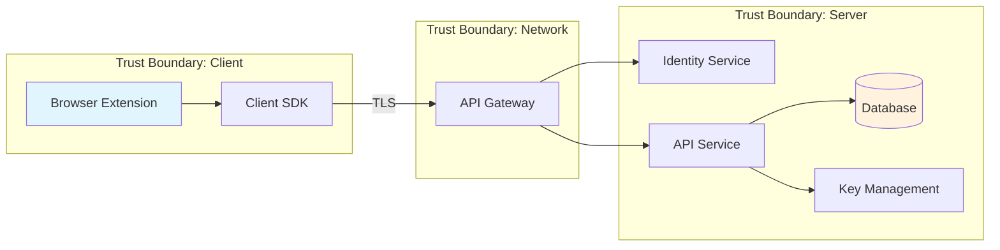

# Data Flow Diagram Template

Use Mermaid syntax for text-based DFDs that can be version-controlled.

Bitwarden is moving toward a Structurizr-based approach for persistent
architecture diagrams. For ad-hoc threat modeling, Mermaid or Excalidraw
are acceptable.

## Example

## Required Elements

Include: components, data stores, external entities, data flows with protocols,
and trust boundaries.
