# Bitwarden Test Engineer Plugin

A test engineering toolkit for Bitwarden — starting with an evidence-grounded inventory of what a change is _already tested by_.

## Overview

This plugin helps you answer one question with evidence, not guesswork: what is a given change **already tested by**? Today it ships one capability — the **`assessing-test-coverage`** skill — and is designed to grow additional testing capabilities over time.

Given a change, the skill finds the existing tests, buckets each by layer, cites it as a stable GitHub permalink, and flags untested behaviors as honest gaps — writing it all to a self-contained markdown coverage report. It is deliberately **backward-looking**: it does not recommend new tests, assign layers, or judge test shape.

## Features

- **Evidence-grounded inventory**: Reports only coverage it can observe and cite — a behavior with no observed test is recorded as a gap, never assumed covered.
- **PRs-first discovery**: Takes tests in linked/merged PR diffs as the primary, permalink-ready evidence, then a targeted lookup scoped to the change surface — never a repo-wide sweep.
- **Layer bucketing**: Sorts each observed test into unit / integration / E2E per repo, using each repo's own conventions.
- **Stable permalink citations**: Cites 1–3 representative tests per behavior as commit-SHA GitHub permalinks (not branch links), plus an approximate count.
- **Config-first, low token spend**: Learns each repo's test tooling from its Claude config before opening any test files, and stops as soon as coverage is confirmed.
- **Self-contained report**: Writes a markdown coverage report — Overview, Summary, Evidence, Coverage, and Gaps — to a per-change directory.

## Skills

| Skill                     | What It Does                                                                                                                                                                                                                                                                                                    |
| ------------------------- | --------------------------------------------------------------------------------------------------------------------------------------------------------------------------------------------------------------------------------------------------------------------------------------------------------------- |
| `assessing-test-coverage` | The backward-looking inventory. Determines what is **already tested** for a change — scoped to the change surface, PR-first then a targeted lookup — buckets each observed test by layer, cites it as a stable GitHub permalink, flags untested behaviors as gaps, and writes a self-contained markdown report. |

## How it works

The skill produces an **evidence-grounded inventory of existing coverage**, scoped to the change
surface. It ingests whatever evidence is available — a GitHub PR (via `gh`), a Jira ticket (via the
Atlassian MCP), an exported test-case CSV, and/or a plain-language description — then:

- learns each repo's test conventions from its Claude config (config-first, to keep token spend low),
- finds existing coverage **PRs-first** (the merged/linked PRs are the permalink-ready backbone),
  then a targeted lookup scoped to the change surface for pre-existing tests,
- buckets each observed test by layer (unit / integration / E2E) per repo,
- cites 1–3 representative tests per behavior as stable GitHub permalinks (commit-SHA links, not
  branch links), plus an approximate count, and
- records any behavior with no observed test as a **gap** (`unverified`) — never assumed covered.

```mermaid
flowchart TD
    Start([User asks: what's already tested for &lt;change&gt;?]) --> Intake

    subgraph Intake["1 · Intake & scope"]
        direction TB
        Inputs["Inputs (additive):<br/>• GitHub PR<br/>• Jira key / Epic<br/>• Tech breakdown<br/>• Test-case CSV<br/>• Plain description"]
        Resolve{"Change surface<br/>supplied?"}
        Inputs --> Resolve
        Resolve -- no --> Derive["Derive surface from<br/>gh pr diff / intake<br/>(references/input-sources.md)"]
        Resolve -- yes --> Surface
        Derive --> Surface["Change surface:<br/>changed paths/symbols,<br/>affected repos, linked PRs"]
    end

    Intake --> Conventions

    Conventions["2 · Learn each repo's conventions<br/>(config-first: CLAUDE.md, .claude/)<br/>stop as soon as answered"]

    Conventions --> Find

    subgraph Find["3 · Find existing coverage"]
        direction TB
        PRs["PRs first — tests in<br/>linked/merged PR diffs<br/>(permalink-ready via head SHA)"]
        Targeted["Then targeted lookup<br/>scoped to change surface<br/>(no repo-wide sweep)"]
        E2E["E2E: inspect sibling<br/>test repo if checked out"]
        PRs --> Targeted --> E2E
    end

    Find --> PerBehavior

    PerBehavior{"For each behavior:<br/>coverage confirmed?"}
    PerBehavior -- "yes (stop at 1–3<br/>representative tests + count)" --> Cite
    PerBehavior -- no --> Gap

    Cite["4a · Cite & bucket<br/>render tests as GitHub permalinks,<br/>bucket by layer (unit/integration/E2E)"]
    Gap["4b · Record gap<br/>mark unverified<br/>(never assumed covered)"]

    Cite --> Inventory
    Gap --> Inventory

    Inventory[("Coverage inventory<br/>one record per behavior<br/>+ unverified gaps")]

    Inventory --> Render

    Render["5 · Render markdown report<br/>(references/coverage-report-template.md)<br/>Overview · Summary · Evidence · Coverage · Gaps"]

    Render --> Output

    subgraph Output["Output"]
        direction TB
        File["Write coverage.md to<br/>test-engineer-report-&lt;slug&gt;-&lt;date&gt;/"]
        Chat["Mirror ## Overview in chat:<br/>observed shape per platform + top gaps"]
        File --> Chat
    end

    Output --> Done([Done])

    classDef store fill:#e8f0fe,stroke:#4285f4,color:#000
    classDef gap fill:#fdecea,stroke:#d93025,color:#000
    class Inventory store
    class Gap gap
```

<details>
<summary>Workflow diagram</summary>



</details>

### Where each layer lives

Unit and integration tests live alongside the code inside each platform repo (e.g.
`bitwarden/server`, `bitwarden/clients`, `bitwarden/ios`). **End-to-end tests live in a dedicated
`test` repository** — a sibling of the platform repos, not inside them — so existing E2E coverage is
recorded as `unverified` when that repo isn't checked out.

## Cross-Plugin Integration

| Plugin                      | How It's Used                                                                                                                                                                                                                                                                                                          |
| --------------------------- | ---------------------------------------------------------------------------------------------------------------------------------------------------------------------------------------------------------------------------------------------------------------------------------------------------------------------- |
| `bitwarden-atlassian-tools` | **Recommended** — the primary way to drive analysis from Jira tickets and linked Confluence requirements, via the `mcp__plugin_bitwarden-atlassian-tools_bitwarden-atlassian__*` server. Optional by design: if absent, the plugin degrades gracefully — paste the requirements or rely on the PR / CSV / description. |

## Installation

```bash
/plugin install bitwarden-test-engineer@bitwarden-marketplace
```

For Jira-backed analysis, install the Atlassian tools alongside it:

```bash
/plugin install bitwarden-atlassian-tools@bitwarden-marketplace
```

## Usage

The skill activates when you ask what a change is already tested by:

```
What's already tested for bitwarden/server#5821?
```

```
Does this PR have tests, and what layers do they cover?
```

```
What coverage exists for the item-types import/export work in PM-32009?
```

Each run produces a per-change directory `test-engineer-report-<slug>-<date>/` holding a
self-contained markdown report, `coverage.md`: the observed tests per layer (each cited as a GitHub
permalink), a per-platform coverage shape, and the gaps. Re-running on the same change and date
refreshes the report in that directory.

## References

- [Claude Code Skills](https://code.claude.com/docs/en/skills)
- [The Testing Trophy](https://kentcdodds.com/blog/the-testing-trophy-and-testing-classifications)
- [Bitwarden Contributing Guidelines](https://contributing.bitwarden.com/contributing/)
