# Bitwarden Test Toolkit Plugin

A test engineering toolkit for Bitwarden — starting with an evidence-grounded inventory of what a change is _already tested by_.

## Overview

This plugin helps you answer one question with evidence, not guesswork: what is a given change **already tested by**? Today it ships one capability — the **`assessing-test-coverage`** skill — and is designed to grow additional testing capabilities over time.

Given a change, the skill finds the existing tests, buckets each by layer, cites it as a stable GitHub permalink, and flags untested behaviors as honest gaps — writing it all to a self-contained markdown coverage report. It is deliberately **backward-looking**: it does not recommend new tests, assign layers, or judge test shape.

## Features

- **Evidence-grounded inventory**: Reports only coverage it can observe and cite — a behavior with no observed test is recorded as a gap, never assumed covered.
- **PRs-first discovery**: Takes tests in linked/merged PR diffs as the primary evidence, then a targeted lookup scoped to the change surface — never a repo-wide sweep.
- **Layer bucketing**: Sorts each observed test into unit / integration / E2E per repo, using each repo's own conventions.
- **Stable permalink citations**: Cites 1–3 representative tests per behavior as GitHub permalinks on the repo's current default branch (not PR-head SHA links, which can point at code later reverted), plus an approximate count.
- **Inspects before it concludes**: Escalates rather than guessing when a repo isn't checked out — grep if it's cloned, otherwise clone it shallow or search it via `gh` — and falls back to `unverified` only when a surface is truly unreachable.
- **Self-contained report**: Writes a markdown coverage report — Overview, Evidence & sources, Coverage, and Gaps — to a timestamped markdown file under `${CLAUDE_PLUGIN_DATA}/coverage-reports/`.

## Skills

| Skill                     | What It Does                                                                                                                                                                                                                                                                                                    |
| ------------------------- | --------------------------------------------------------------------------------------------------------------------------------------------------------------------------------------------------------------------------------------------------------------------------------------------------------------- |
| `assessing-test-coverage` | The backward-looking inventory. Determines what is **already tested** for a change — scoped to the change surface, PR-first then a targeted lookup — buckets each observed test by layer, cites it as a stable GitHub permalink, flags untested behaviors as gaps, and writes a self-contained markdown report. |

## How it works

The skill produces an **evidence-grounded inventory of existing coverage**, scoped to the change
surface. It ingests whatever evidence is available — a GitHub PR (via `gh`), a Jira ticket (via the
Atlassian MCP), a Tech Breakdown doc, and/or a Testmo test-case CSV — then:

- resolves the input into a change surface and the repos it touches,
- finds existing coverage **PRs-first** (the merged/linked PRs are the permalink-ready backbone),
  then a targeted lookup scoped to the change surface for pre-existing tests,
- buckets each observed test by layer (unit / integration / E2E) per repo,
- cites 1–3 representative tests per behavior as stable GitHub permalinks on the repo's current
  default branch (not PR-head SHA links), plus an approximate count, and
- records any behavior with no observed test as a **gap** (`unverified`) — never assumed covered.

```mermaid
flowchart TD
    Start([User asks: what's already tested for &lt;change&gt;?]) --> Intake

    subgraph Intake["1 · Intake & scope"]
        direction TB
        Inputs["Inputs (additive):<br/>• GitHub PR<br/>• Jira key / Epic<br/>• Tech breakdown<br/>• Testmo test-case CSV"]
        Resolve{"Change surface<br/>supplied?"}
        Inputs --> Resolve
        Resolve -- no --> Derive["Derive surface from<br/>gh pr diff / intake"]
        Resolve -- yes --> Surface
        Derive --> Surface["Change surface:<br/>changed paths/symbols,<br/>affected repos, linked PRs"]
    end

    Intake --> Behaviors

    Behaviors["2 · List the change's<br/>testable behaviors"]

    Behaviors --> Find

    subgraph Find["3 · Find existing coverage"]
        direction TB
        PRs["PRs first — tests in<br/>linked/merged PR diffs"]
        Targeted["Then targeted lookup<br/>scoped to change surface<br/>(no repo-wide sweep)"]
        E2E["E2E: inspect sibling test repos —<br/>bitwarden/test (cross-platform) &amp;<br/>bitwarden/browser-interactions-testing<br/>(browser-extension, Playwright)"]
        Escalate["Repo not checked out? escalate —<br/>grep if cloned · else clone shallow ·<br/>else search via gh"]
        PRs --> Targeted --> E2E --> Escalate
    end

    Find --> PerBehavior

    PerBehavior{"For each behavior:<br/>coverage confirmed?"}
    PerBehavior -- "yes (stop at 1–3<br/>representative tests + count)" --> Cite
    PerBehavior -- no --> Gap

    Cite["4a · Cite & bucket<br/>render tests as default-branch permalinks,<br/>bucket by layer (unit/integration/E2E)"]
    Gap["4b · Record gap<br/>mark unverified only when truly<br/>unreachable (never assumed covered)"]

    Cite --> Inventory
    Gap --> Inventory

    Inventory[("Coverage inventory<br/>one record per behavior<br/>+ unverified gaps")]

    Inventory --> Render

    Render["5 · Render markdown report<br/>Overview · Evidence &amp; sources · Coverage · Gaps"]

    Render --> Output

    subgraph Output["Output"]
        direction TB
        File["Write &lt;slug&gt;-&lt;timestamp&gt;-coverage.md<br/>under CLAUDE_PLUGIN_DATA/coverage-reports/"]
    end

    Output --> Done([Done])

    classDef store fill:#e8f0fe,stroke:#4285f4,color:#000
    classDef gap fill:#fdecea,stroke:#d93025,color:#000
    class Inventory store
    class Gap gap
```

<details>
<summary>Workflow diagram</summary>



</details>

### Where each layer lives

Unit and integration tests live alongside the code inside each platform repo (e.g.
`bitwarden/server`, `bitwarden/clients`, `bitwarden/ios`). **End-to-end tests live in dedicated
sibling repositories**, not inside the platform repos: `bitwarden/test` (cross-platform) and
`bitwarden/browser-interactions-testing` (browser-extension, Playwright) — check both when the
extension / web-autofill surface is in scope. When an E2E repo isn't already checked out, the skill
escalates before concluding — it clones it shallow or searches it via `gh` — and records coverage as
`unverified` only when the surface stays truly unreachable.

## Cross-Plugin Integration

| Plugin                      | How It's Used                                                                                                                                                                                                                                                                                                                                                                                             |
| --------------------------- | --------------------------------------------------------------------------------------------------------------------------------------------------------------------------------------------------------------------------------------------------------------------------------------------------------------------------------------------------------------------------------------------------------- |
| `bitwarden-atlassian-tools` | **Recommended** — the primary way to drive analysis from Jira tickets and linked Confluence requirements, via its `researching-jira-issues` skill and Atlassian MCP tools. Optional by design: if absent, drive the analysis from the PR / CSV / tech-breakdown / description instead. A Jira ticket input, however, requires the plugin — without it, stop and ask the user to install and configure it. |

## Installation

```bash
/plugin install bitwarden-test-toolkit@bitwarden-marketplace
```

For Jira-backed analysis, install the Atlassian tools alongside it:

```bash
/plugin install bitwarden-atlassian-tools@bitwarden-marketplace
```

## Usage

The skill activates when you ask what a change is already tested by:

```
What's already tested for bitwarden/server#5821?
```

```
Does this PR have tests, and what layers do they cover?
```

```
What coverage exists for the item-types import/export work in PM-32009?
```

Each run writes a self-contained markdown report to
`${CLAUDE_PLUGIN_DATA}/coverage-reports/<slug>-<timestamp>-coverage.md`: the observed tests per
layer (each cited as a GitHub permalink), a per-platform coverage shape, and the gaps. Because the
filename is timestamped, each run produces a new report rather than overwriting the previous one.

## References

- [Claude Code Skills](https://code.claude.com/docs/en/skills)
- [Bitwarden Contributing Guidelines](https://contributing.bitwarden.com/contributing/)
